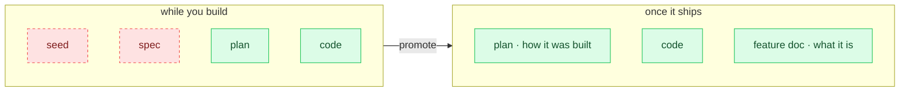

# sdlight

**A lightweight SDLC for one person and a coding agent.** Ideas go in as
half-formed sparks. Features come out with documentation that wrote
itself. The bureaucracy cleans up after itself, so you can stay in the
part you actually like — solving the problem.

No extra plugins. Runs on Claude Code and Pi from the same `skills/`.

## The journey of an idea

```mermaid
flowchart LR
    idea([💡 spark]):::spark
    seed[seed-capture]:::auto
    spec[sdlc-brainstorm<br/>→ spec]:::author
    plan[sdlc-plan]:::author
    g1{plan<br/>review}:::gate
    build[you build,<br/>step by step]:::human
    g2{step<br/>review}:::gate
    g3{final<br/>review}:::gate
    promote[sdlc-promote]:::auto
    doc([📄 feature doc]):::spark

    idea --> seed --> spec --> plan --> g1 --> build --> g2
    g2 -->|next step| build
    g2 -->|steps done| g3 --> promote --> doc

    classDef spark fill:#fef3c7,stroke:#f59e0b,color:#78350f
    classDef auto fill:#e0e7ff,stroke:#6366f1,color:#312e81
    classDef author fill:#dcfce7,stroke:#22c55e,color:#14532d
    classDef gate fill:#fee2e2,stroke:#ef4444,color:#7f1d1d
    classDef human fill:#f3f4f6,stroke:#6b7280,color:#111827
```

It starts as a shower thought. You drop it — half a sentence — and keep
moving; **seed-capture** files it and gets out of your way. No triage, no
"is this in scope," no ceremony.

Later, when you want to build it, **sdlc-brainstorm** turns the seed over
with you in a real conversation — weighing two or three genuine routes
before committing one to a spec. Tangents don't derail the session; they
get seeded and set aside for another day.

The spec becomes a plan (**sdlc-plan**), and here's where sdlight earns
its keep: **nothing reaches your code without passing a gate.** A
fresh-eyed reviewer checks the plan against the spec before a line is
written. You build it one step at a time, and each step is checked
against the plan it came from. When the last step lands, a final review
holds the whole thing up against the *spec* — not the plan — to catch
drift between what you meant and what you made.

Pass, and **sdlc-promote** does the satisfying part:

It writes the feature doc from what you actually built, then **deletes
the seed and the spec.** The scaffolding dissolves. What remains is the
code and one honest document describing it.

Meanwhile **sdlc-refine** quietly gardens the whole vault after every
brainstorm and every promotion — merging duplicate seeds, mapping how
your ideas relate, correcting feature docs the code has outgrown, and
regenerating the project overview. You never file paperwork. It files
itself.

## The skills

In pipeline order.

| Skill | What it does |
|---|---|
| `seed-capture` | Files a rough idea as `seeds/<slug>.md` and nothing more |
| `sdlc-brainstorm` | Converges a seed into a spec; forks tangents into new seeds |
| `sdlc-refine` | Dedupes seeds, maps relations, corrects feature docs, regenerates the overview |
| `sdlc-plan` | Turns a spec into a plan, then hands it to review |
| `sdlc-plan-review` | Checks the plan against the spec in fresh context — PASS, GAPS, or HOLD |
| `sdlc-step-review` | Checks one step's diff against that step — PASS or FAIL |
| `sdlc-final-review` | Checks the implementation against the spec, not the plan |
| `sdlc-promote` | Writes the feature doc, deletes the seed and spec, commits last |

Execution itself isn't a skill. You build each step however you like;
sdlight only owns the gate between steps.

## Two platforms, one source

Claude Code plugin and Pi package, from the same `skills/` and
`templates/`. Both implement the same Agent Skills spec (SKILL.md plus
frontmatter), so the skills are identical — only the manifest differs.

- **Install it** → [docs/install.md](docs/install.md)
- **How it runs** — git, phases, human gates → [docs/workflow.md](docs/workflow.md)
- **Where files live** → [docs/layout.md](docs/layout.md)
- **Model routing** → [docs/model-routing.md](docs/model-routing.md)
- **Not built yet** → [docs/roadmap.md](docs/roadmap.md)
