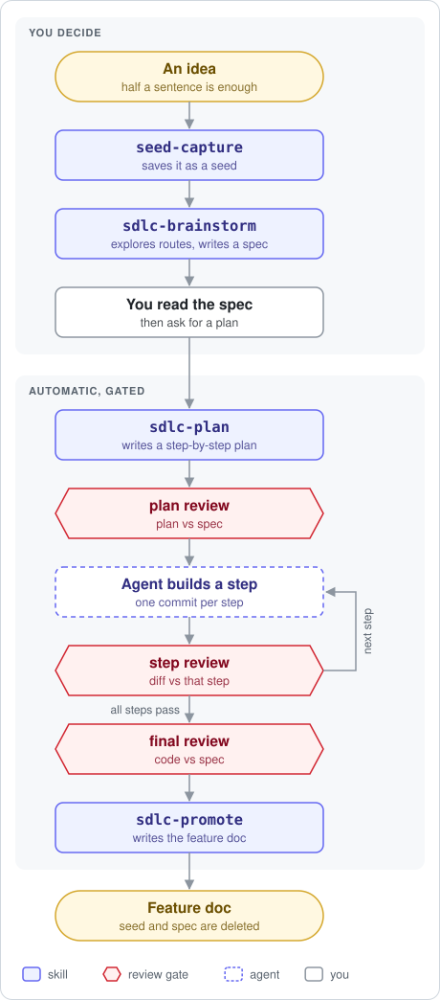
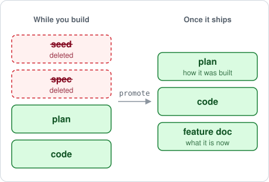

# sdlight

A lightweight development workflow for one developer and a coding agent.

You jot ideas down as short notes. When you want to build one, you shape
it into a spec with the agent. The agent then plans, builds, and reviews
the work against that spec, and when the feature ships it writes the
feature's documentation from the code and deletes the notes that led to
it.

sdlight is eight agent skills. They run on [Claude Code](https://claude.com/claude-code)
and [Pi](https://github.com/earendil-works/pi) from the same source and
need no other plugins.

## Why

Spec-driven development is a great fit for coding agents, but the
workflows around it tend to be bureaucratic and slow. I wanted something
lighter that leaves room for creativity.

- **Ideas first.** Ideas show up at any time. A seed takes one sentence
  to capture and waits until you want it.
- **What, not how.** A spec only matters while you build it. Once a
  feature ships, its seed and spec are deleted. What's left is the code,
  a feature doc, and `PROJECT.md`, and that's what future work builds on.
- **Plans are history.** Plans stay in the repo as a record of how
  something was built, not as docs to keep up to date.

## Quick start

In Claude Code:

```
/plugin marketplace add smaragden/sdlight
/plugin install sdlight@sdlight-marketplace
```

Then copy this repo's `templates/` folder into `docs/sdlight/templates/`
in your project. For Pi, see [docs/install.md](docs/install.md).

Now talk to your agent as usual:

- "Idea: the export command could write CSV." The agent saves it as a seed.
- "Let's brainstorm the CSV export seed." You talk it through and get a spec.
- "Plan csv-export." The agent plans, builds, reviews, and ships it.

## How an idea moves through it

<picture>
  <source media="(prefers-color-scheme: dark)" srcset="docs/img/pipeline-dark.svg">
  
</picture>

1. **Capture.** Mention an idea and `seed-capture` saves it as a
   one-paragraph file in `docs/sdlight/seeds/`. It doesn't judge or expand
   the idea.
2. **Brainstorm.** When you want to build it, `sdlc-brainstorm` talks it
   through with you. Where there's a real choice, it compares two or three
   approaches before writing a spec. Side ideas that come up become new
   seeds instead of growing the spec.
3. **You read the spec.** The workflow stops here. The spec is the one
   place your judgment matters most.
4. **Plan.** When you ask, `sdlc-plan` writes a step-by-step plan. A
   reviewer with fresh context checks it against the spec before any code
   is written.
5. **Build.** The agent implements the plan on a feature branch, one
   commit per step. A reviewer checks each step's diff against that step.
6. **Final review.** A reviewer checks the finished code against the spec,
   not the plan, to catch drift between what you meant and what got built.
7. **Promote.** `sdlc-promote` writes a feature doc from the code as built
   and deletes the seed and spec. The plan stays as a record of how it was
   built.

From step 4 on, the agent runs without asking. It stops only when a
review needs a human decision. See [docs/workflow.md](docs/workflow.md)
for the exact stopping points.

<picture>
  <source media="(prefers-color-scheme: dark)" srcset="docs/img/lifecycle-dark.svg">
  
</picture>

After every brainstorm and every promotion, `sdlc-refine` tidies up. It
merges duplicate seeds, records which ideas relate, fixes feature docs
the code has since contradicted, and regenerates a project overview.

## The skills

| Skill | What it does |
|---|---|
| `seed-capture` | Saves a rough idea as `docs/sdlight/seeds/<slug>.md` |
| `sdlc-brainstorm` | Turns a seed into a spec, and side ideas into new seeds |
| `sdlc-refine` | Merges seeds, maps related ideas, fixes stale feature docs, regenerates the overview |
| `sdlc-plan` | Turns a spec into a plan, then drives review and the build |
| `sdlc-plan-review` | Checks the plan against the spec: PASS, GAPS, or HOLD |
| `sdlc-step-review` | Checks one step's diff against that step: PASS or FAIL |
| `sdlc-final-review` | Checks the finished code against the spec: PASS, FAIL, or HOLD |
| `sdlc-promote` | Writes the feature doc and deletes the seed and spec |

There is no build skill. The agent writes code with its normal tools, and
sdlight supplies the review between steps.

## Pi extras

On Pi, sdlight also loads a small extension:

- a status line with the number of seeds and how many are uncommitted,
- `/seeds` to list uncommitted seeds,
- `/browse-seeds` to scroll through seeds, jump to a random one, and start
  a brainstorm on it.

## Documentation

- [Install](docs/install.md): Claude Code, Pi, and templates
- [Workflow](docs/workflow.md): git rules, project phase, when it stops to ask
- [Layout](docs/layout.md): where files live
- [Model routing](docs/model-routing.md): which stages use which model
- [Roadmap](docs/roadmap.md): what's missing

## License

MIT. See [LICENSE](LICENSE).
